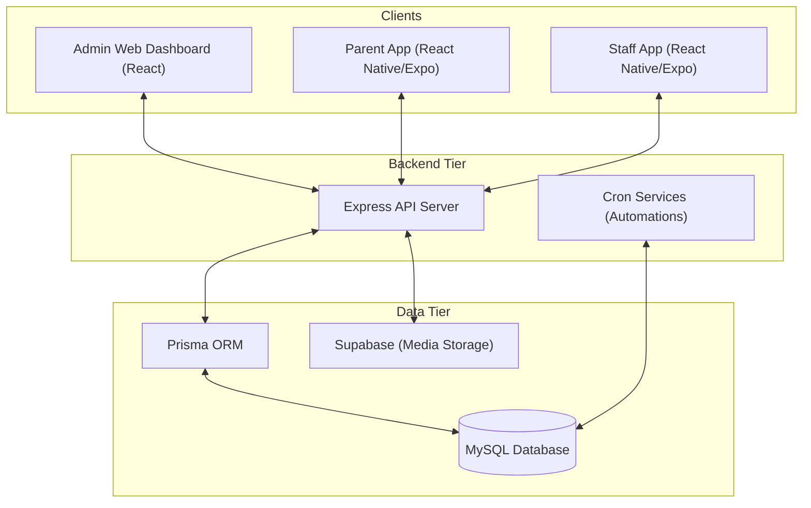

# Preschool Management System: System Overview

Welcome to the comprehensive documentation for the **Preschool Management System**. This system is a full-stack solution designed to streamline administrative tasks, student tracking, financial management, and parent communication for modern preschools.

## 🚀 Hosting & Production Environment

The system is currently hosted and accessible at **[malkakulufuturemind.me](https://malkakulufuturemind.me)**.

### Infrastructure Stack
*   **Web Server**: Nginx (handling reverse proxy and SSL termination).
*   **Process Manager**: PM2 (ensuring the Node.js backend remains active and auto-restarts on failure).
*   **Database**: MySQL (hosted instance for persistent data storage).
*   **Storage**: Supabase Storage (for secure hosting of media assets like student photos and event videos).

---

## 🏗️ System Architecture

The system follows a modular architecture consisting of a central API server, a web administration dashboard, and two specialized mobile applications.

---

## 🛠️ Components Table

| Part | Description | Primary Users |
|------|-------------|---------------|
| **[Backend](./backend.md)** | The engine of the system. Handles Auth, Billing, and Cron jobs. | System |
| **[Admin Web](./admin-web.md)** | Central control panel for management and reporting. | Admins, Staff, Cashiers |
| **[Mobile Apps](./mobile-apps.md)** | On-the-go tools for parents and teachers. | Parents, Teachers |
| **[Business Logic](./business-logic.md)** | Detailed logic for progress assessment and billing. | Internal Systems |

---

## 🛡️ Quality Assurance (QA) Summary

To ensure reliability and accuracy, the following QA techniques were applied:
1.  **Validation Audits**: Dual-layer verification (Ant Design rules on frontend + Zod schemas on backend).
2.  **Error Handling Logs**: Centralized mapping of database constraints to user-friendly notifications.
3.  **Manual Data Entry Testing**: Verified real-world scenarios for student enrollment and billing.
4.  **Cross-Device Verification**: Chrome/Edge browser compatibility and testing across multiple Android/iOS physical devices for the Expo apps.
5.  **Role Verification**: Ensuring `CASHIER` and `TEACHER` accounts only see data permitted by their scoped permissions.
