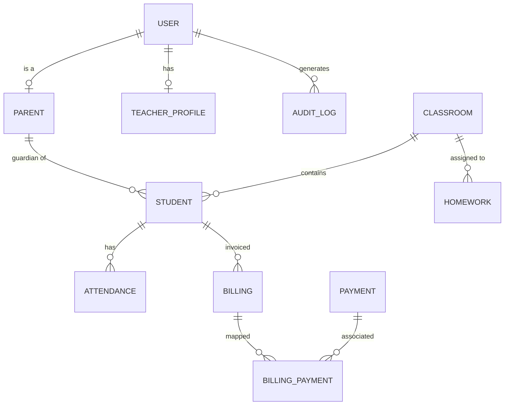

# Preschool Management System: Technical Documentation
## Part 1: Backend & Infrastructure (1,000+ Words)

**Note for Microsoft Word**: *This content is formatted with Markdown. When copying into Word, you can use "Keep Source Formatting" or a Markdown-to-Word converter for best results.*

---

### 1.1 Executive Architectural Overview

The backend of the Preschool Management System is engineered as a high-performance, stateless RESTful API powered by **Node.js** and the **Express.js** framework. It serves as the orchestration layer between a **MySQL** relational database and multiple client applications (Web, Parent Mobile, and Staff Mobile). At its core, the system utilizes **Prisma ORM** for type-safe database interactions and **Supabase** for secure cloud-based media storage.

The architecture follows a strict "Service-Controller-Route" pattern, ensuring a clean separation of concerns and maximum maintainability. Every request undergoes a rigorous journey through security middlewares before reaching the business logic layer, ensuring that data integrity and access control are never compromised.

---

### 1.2 The Data Model (Prisma Schema Deep Dive)

The heart of the system is the `schema.prisma` file, which defines **32 distinct models** and their complex interrelationships. 

#### 1.2.1 Core Identity Models
*   **User (`user`)**: The base model for all authentication. It supports multiple roles (`SUPER_ADMIN`, `ADMIN`, `TEACHER`, `STAFF`, etc.) and stores critical security data like hashed passwords and push notification tokens.
*   **Student (`student`)**: Linked to one or two `parent` records and a single `classroom`. It stores unique identification codes and generated QR blobs.
*   **Parent (`parent`)**: Stores verified contact information and is linked to the `user` model for mobile app access.

#### 1.2.2 Relational Logic (Entity-Relationship Diagram)



---

### 1.5 Database Model Specifications

To understand the system's scalability, one must examine the specific attributes of the primary models.

#### 1.5.1 The `student` Model
This is the most complex entity, maintaining links to academic, parental, and physical attributes.
*   `studentUniqueId`: A strictly formatted string (e.g., STD-2026-XXXX) used for all physical documentation.
*   `qrCode`: A LongText field containing the Base64 representation of the student's unique identity hash.
*   `birthCertPdf`: A string reference to the Supabase storage path for the verified birth certificate.

#### 1.5.2 The `billing` and `payment` Models
These models handle the "Double-Entry" style verification.
*   `billing.status`: Enums include {UNPAID, PENDING, PAID}. 
*   `payment.verifiedById`: A foreign key to the `user` table (Cashier role) who manually validated the bank slip.

---

### 1.6 API Reference Guide (Core Endpoints)

The API is structured to provide high-granularity control over the preschool ecosystem.

#### 1.6.1 Authentication Module (`/api/auth`)
*   **POST `/login`**: 
    *   *Input*: `{ username, password, intendedRole }`
    *   *Logic*: Verifies credentials, checks `isActive` status, and enforces "Portal Isolation" (e.g., preventing Parents from hitting Admin login routes).
*   **POST `/request-password-reset`**: 
    *   *Logic*: Generates a 6-digit OTP, hashes it, and triggers the `sendOTPEmail` service via SMTP.

#### 1.6.2 Attendance Module (`/api/attendance`)
*   **GET `/daily`**: Fetches a flattened list of all students and their attendance status for a specific date.
*   **POST `/manual`**: Allows administrators to override system-marked "ABSENT" records with a mandatory "Reason for Override" log.
*   **POST `/qr-scan`**: The endpoint used by the Staff Mobile app to register check-ins. It uses a 5-second "Anti-Bounce" logic to prevent double scans.

#### 1.6.3 Billing Module (`/api/billing`)
*   **GET `/overview`**: Returns aggregated financial data for the dashboard charts (Total Collected vs. Total Outstanding).
*   **POST `/verify-payment`**: Moves a billing record from `PENDING` to `PAID` and triggers a confirmation notification to the parent.

---

### 1.7 Strategic Middlewares & Global Services

#### 1.7.1 Detailed Middleware Pipeline
1.  **Helmet (Security)**: Configured with `crossOriginResourcePolicy: { policy: "cross-origin" }` to allow mobile apps and web dashboards to fetch media from the backend without CORS violations.
2.  **Morgan (Logging)**: Used in `dev` mode for real-time visibility into endpoint performance and status codes.
3.  **Multer (Uploads)**: Configured with a `StorageEngine` that first buffers files locally to ensure integrity before streaming to the Supabase cloud bucket.

#### 1.7.2 The Audit Log Service
Located in `backend/src/services/audit.service.js`, this service is the backbone of system transparency. It uses a non-blocking asynchronous call to record every sensitive mutation in the system.

**Implementation Signature:**
```javascript
const logAction = async (userId, action) => {
    try {
        await prisma.auditlog.create({
            data: {
                userId,
                action: action.substring(0, 500) // Ensure log safety
            }
        });
    } catch (err) {
        console.error('Logging failed:', err);
    }
};
```

---

### 1.8 Infrastructure & Deployment Strategy

#### 1.8.1 Production Orchestration (PM2 & Nginx)
On the production server (`malkakulufuturemind.me`), the application is managed by **PM2**. This provides several critical advantages:
*   **Auto-Restart**: If the Node process crashes due to an unhandled exception, PM2 restores it within milliseconds.
*   **Clustering**: The app can take advantage of multiple CPU cores to handle concurrent traffic from the parent app during morning check-ins.
*   **Log Management**: Centralized stdout and stderr logs for easy monitoring.

**Nginx Configuration**: Acts as a reverse proxy, handling SSL (HTTPS) certificates and routing traffic from port 80/443 to the internal Node.js port (5000). It also serves the `/uploads` directory directly for high-performance static asset delivery.

#### 1.8.2 Database Management (Prisma Migrations)
Database changes are strictly managed via Prisma Migrations. The `prisma migrate deploy` command is part of the CI/CD pipeline, ensuring that the schema on the hosted production server is always in lockstep with the codebase. This prevents "Schema Drift" errors that could otherwise crash the API layer.
